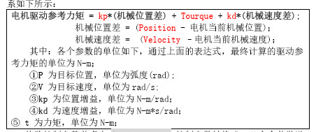

## 机械臂

### 1.总体介绍

机械臂具有七个自由度（可控制角度），包括 底座、一级臂、二级臂、大轴向（爪子以及后方的舵机与摄像头）、爪子摆动、爪子轴向、爪子开合

所有角度皆为弧度制表示

### 2.一级臂

一级臂使用一个MOTOR GIM8008电机，电机内部有电位器等部件，我们只需通过CAN向其发送信息即可

注意：由于电机自身零点不准问题，以及角度比例不一致，故对角度进行一系列nt的计算？？？

资料见（**硬件资料\MIT驱动板相关资料_V1.3**）

具体代码见GIM8008文件

### 3.二级臂

二级臂使用RM3508电机，我们通过CAN向其发送信息，表示电流大小（力矩大小）

资料见（**硬件资料\M3508电机**）

我们使用了电位器，先采集电压，转换为当前角度，并通过角度之间PID进行计算，并转换为电机的力矩（电流），传给电机

具体代码见Motor_Control

### 4.舵机（底座、大轴向、爪子摆动、爪子轴向、爪子开合）

以上五个全部为舵机，舵机皆为PWM控制，底座为+-270度，其余皆为+-180度，部分舵机受机械限制，无法达到最大位置

具体代码见arm

### 5.问题

舵机的转动速度较慢，且位于循环中，假如在中断函数中进行，会出现相互影响的情况，如二级臂暴走

目前将其放于主函数中处理

可尝试方法：更改为HAL库、对中断优先级处理、使用FreeRTOS

