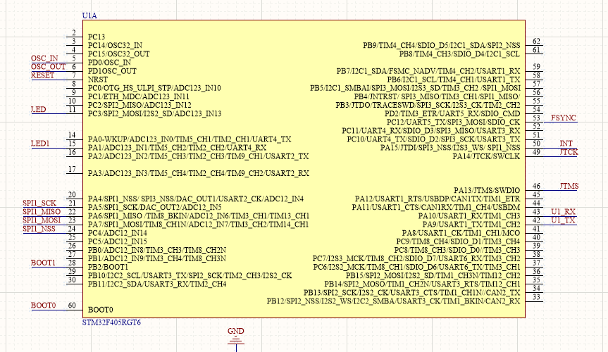

## IMU代码

##### 原理图



#### 1.main_AHRS.cpp

##### (1)main函数

```c
int main(void)
{
	mcu_init();
	CAHRSApp kf(0.0);

	eb = CVect3(-4.26,1.1,-0.85);  // 陀螺零偏 deg/s
	db = CVect3(0.0,0.0,-0.5/9.8);  // 加计偏值 m/s
		 
	while(1)
	{
        //10ms一次
		if(GAMT_OK_flag==1)
		{
			GAMT_OK_flag = 0;
			wm = (*(CVect3*)mpu_Data_value.Gyro-eb)*(glv.dps*ts);//mpu读取的三个数据减去零漂
			vm = (*(CVect3*)mpu_Data_value.Accel-db)*(glv.g0*ts);
			kf.Update(wm, vm, gpsvn, gpspos, ts);  iter = kf.iter;//卡尔曼滤波之类的算法，已封装至ahrsapp.o
			INSUartOut(kf.sins);//将计算的角度装载至串口
		}	
	}
}
```

GAMT_OK_flag：在TIM2中断中置1

ts：0.01

glv：const CGLV   glv;//即地球的常数，此类中所有变量皆为物理常数

```
class CGLV
{
public:
	double Re, f, g0, wie;											// the Earth's parameters
	double e, e2;
	double mg, ug, deg, min, sec, hur, ppm, ppmpsh;					// commonly used units
	double dps, dph, dpsh, dphpsh, ugpsh, ugpsHz, mpsh, mpspsh, secpsh;

	CGLV(double Re=6378137.0, double f=(1.0/298.257), double wie0=7.2921151467e-5, double g0=9.7803267714);
};
```

CVect3：3个变量的向量，可以进行加减乘除等各项操作

```c
class CVect3 
{
public:
	double i, j, k;

	CVect3(void);
	CVect3(double xx, double yy=0.0, double zz=0.0);
	CVect3(const double *pdata);

	CVect3 operator+(const CVect3 &v) const;				// vector addition
	CVect3 operator-(const CVect3 &v) const;				// vector subtraction
	CVect3 operator*(const CVect3 &v) const;				// vector cross multiplication
	CVect3 operator*(double f) const;						// vector multiply scale
    ....
```

```c
//将计算的角度装载至串口
void INSUartOut(const CSINS &sins)
{
	att = q2att(sins.qnb); //计算角度
	
	out_data.Att[0] = att.i/glv.deg; 
	out_data.Att[1] = att.j/glv.deg; 
	out_data.Att[2] = CC180toC360(att.k)/glv.deg;//保证角度在0-360度
    
}
```

q2att将四元数转换为姿态角（Matlab上有相似函数）

```
CVect3 q2att(const CQuat &qnb)
{
	double	q11 = qnb.q0*qnb.q0, q12 = qnb.q0*qnb.q1, q13 = qnb.q0*qnb.q2, q14 = qnb.q0*qnb.q3, 
			q22 = qnb.q1*qnb.q1, q23 = qnb.q1*qnb.q2, q24 = qnb.q1*qnb.q3,     
			q33 = qnb.q2*qnb.q2, q34 = qnb.q2*qnb.q3,  
			q44 = qnb.q3*qnb.q3;
	CVect3 att;
	att.i = asinEx(2*(q34+q12));
	att.j = atan2Ex(-2*(q24-q13), q11-q22-q33+q44);
	att.k = atan2Ex(-2*(q23-q14), q11-q22+q33-q44);
	return att;
}
```

CAHRSApp继承自CKalman，故Update可能为卡尔曼滤波算法等

```
class CAHRSApp:public CSINSTDKF
class CSINSTDKF:public CSINSKF
class CSINSKF:public CKalman
```


#### 2.mcu_init.c

```c
void mcu_init (void)
{
	RCC_Configuration ();
	GPIO_Configuration ();
	USART1_Configuration ();
	SPI1_Configuration ();
	TIM2_Configuration ();
	Init_MPU9250 ();
	NVIC_Configuration ();
}
```

初始化芯片，其中SPI使用PA5、PA6、PA7和PC4，TIM2中断周期为10ms。

**注意：usart1波特率460800，且使用DMA发送，即将所传输数据放入Usart1_out_DATA[200]中，即可自动传输**


#### 3.mpu9250.c

```c
void WriteTo9250 (u8 TxData)
{
	//	u8 i = 0;
	u8 ValueToWrite = 0;

	ValueToWrite = TxData;
	while (SPI_I2S_GetFlagStatus (SPI1, SPI_I2S_FLAG_TXE) == RESET)
	{
		;
	}
	SPI_I2S_SendData (SPI1, ValueToWrite);
	while (SPI_I2S_GetFlagStatus (SPI1, SPI_I2S_FLAG_RXNE) == RESET)
	{
		;
	}
	SPI_I2S_ReceiveData (SPI1);

}

u8 ReadToMpu9250 (u8 reg)
{
	//	 u8 i = 0;
	u8 ReadData = 0;

	while (SPI_I2S_GetFlagStatus (SPI1, SPI_I2S_FLAG_TXE) == RESET);
	SPI_I2S_SendData (SPI1, reg);
	while (SPI_I2S_GetFlagStatus (SPI1, SPI_I2S_FLAG_RXNE) == RESET);
	ReadData = SPI_I2S_ReceiveData (SPI1);
	return(ReadData);
}
```

即MPU9250的通信方式为SPI。

```c
//************************读取加速度计**************************/
void READ_MPU9250_A_T_G (void)
{

	while (!GPIO_ReadInputDataBit (GPIOA, GPIO_Pin_15))
	{
		;
	}		//中断引脚INT，为1时数据更新完成

	BUF[0] = MPU9250_Read_Reg (ACCEL_XOUT_L);
	BUF[1] = MPU9250_Read_Reg (ACCEL_XOUT_H);
	mpu_AD_value.Accel[0] = (BUF[1] << 8) | BUF[0];
	mpu_Data_value.Accel[0] = (double) mpu_AD_value.Accel[0] / (double) 8192;// x轴加速度
	//	 Acc_temp[0][Acc_cnt]=(double)mpu_AD_value.Accel[0]/(double)8192;
	//	 mpu_Data_value.Accel[0]=max_min_chioce(&Acc_temp[0][0],5);

	BUF[2] = MPU9250_Read_Reg (ACCEL_YOUT_L);
	BUF[3] = MPU9250_Read_Reg (ACCEL_YOUT_H);
	mpu_AD_value.Accel[1] = (BUF[3] << 8) | BUF[2];
	mpu_Data_value.Accel[1] = (double) mpu_AD_value.Accel[1] / (double) 8192;// y轴加速度
	//   Acc_temp[1][Acc_cnt]=(double)mpu_AD_value.Accel[1]/(double)8192;
	//	 mpu_Data_value.Accel[1]=max_min_chioce(&Acc_temp[1][0],5);	

	BUF[4] = MPU9250_Read_Reg (ACCEL_ZOUT_L);
	BUF[5] = MPU9250_Read_Reg (ACCEL_ZOUT_H);
	mpu_AD_value.Accel[2] = (BUF[5] << 8) | BUF[4];
	mpu_Data_value.Accel[2] = (double) mpu_AD_value.Accel[2] / (double) 8192;// z轴加速度
	//	 Acc_temp[2][Acc_cnt]=(double)mpu_AD_value.Accel[2]/(double)8192;
	//	 mpu_Data_value.Accel[2]=max_min_chioce(&Acc_temp[2][0],5);

	BUF[0] = MPU9250_Read_Reg (GYRO_XOUT_L);
	BUF[1] = MPU9250_Read_Reg (GYRO_XOUT_H);
	mpu_AD_value.Gyro[0] = (BUF[1] << 8) | BUF[0];
	mpu_Data_value.Gyro[0] = ((double) mpu_AD_value.Gyro[0] / (double) 65.5);//+3.5; // 陀螺仪x轴方向
    
	BUF[2] = MPU9250_Read_Reg (GYRO_YOUT_L);
	BUF[3] = MPU9250_Read_Reg (GYRO_YOUT_H);
	mpu_AD_value.Gyro[1] = (BUF[3] << 8) | BUF[2];
	mpu_Data_value.Gyro[1] = ((double) mpu_AD_value.Gyro[1] / (double) 65.5);//-0.9; // 陀螺仪y轴方向	
    
	BUF[4] = MPU9250_Read_Reg (GYRO_ZOUT_L);
	BUF[5] = MPU9250_Read_Reg (GYRO_ZOUT_H);
	mpu_AD_value.Gyro[2] = (BUF[5] << 8) | BUF[4];
	mpu_Data_value.Gyro[2] = (double) mpu_AD_value.Gyro[2] / (double) 65.5;// 陀螺仪z轴方向
}
```

SPI读出mpu的三个陀螺仪三轴和三个角加速度

#### 4.usart.c

```c
void Data_updata(void)
{
	float Data_F;
	double Data_D;
	u32 Data_U, i, checksum;
	u8 *pcheck;
//////////////////////////////////////////////////	
	out_data.OUT_cnt=(float)((double)OUT_cnt/(double)1000);
	out_data.Gyro[0]=(float)mpu_Data_value.Gyro[0];
	out_data.Gyro[1]=(float)mpu_Data_value.Gyro[1];
	out_data.Gyro[2]=(float)mpu_Data_value.Gyro[2];
	
	out_data.Accel[0]=(float)(mpu_Data_value.Accel[0]*(double)9.8);
	out_data.Accel[1]=(float)(mpu_Data_value.Accel[1]*(double)9.8);
	out_data.Accel[2]=(float)(mpu_Data_value.Accel[2]*(double)9.8);
	
	out_data.Temp=mpu_Data_value.Temp;
    
	*(   u32*)&Usart1_out_DATA[ 0*4] = 0xffffffff;
//	*(float*)&Usart1_out_DATA[ 1*4] = out_data.Gyro[0];
//	*(float*)&Usart1_out_DATA[ 2*4] = out_data.Gyro[1];
//	*(float*)&Usart1_out_DATA[ 3*4] = out_data.Gyro[2]; 
//	*(float*)&Usart1_out_DATA[ 4*4] = out_data.Accel[0];
//	*(float*)&Usart1_out_DATA[ 5*4] = out_data.Accel[1];
//	*(float*)&Usart1_out_DATA[ 6*4] = out_data.Accel[2];
	*(float*)&Usart1_out_DATA[ 1*4] = out_data.Att[0];	//pitch
	*(float*)&Usart1_out_DATA[ 2*4] = out_data.Att[1];	//roll
	*(float*)&Usart1_out_DATA[ 3*4] = out_data.Att[2];	//yaw
    
	Usart1_out_Length=4*4;
}
```

将最终的角度数据通过串口1发送至云台

#### 5.stm32f4xx_it.c

```c
void TIM2_IRQHandler (void)
{
	if (TIM_GetITStatus (TIM2, TIM_IT_Update) != RESET)
	{
		TIM_ClearITPendingBit (TIM2, TIM_IT_Update);

		GPIO_SetBits (GPIOC, GPIO_Pin_3);
		READ_MPU9250_A_T_G ();
		//		 READ_MPU9250_MAG();
		GAMT_OK_flag = 1;
		Data_updata ();
		USART1_DIA_OUT_Configuration ();//串口DMA发送
		GPIO_ResetBits (GPIOC, GPIO_Pin_3);
	}
}
```


### 总体流程

#### 1.初始化

包括初始化定时器TIM2（中断间隔为10ms），SPI通信（获取MPU9250采集的值），串口通信

（将最终角度发送至云台）

此外，还要通过SPI向MPU9250发送信息进行设置


#### 2.定时器中断

TIM2间隔10ms中断，

先READ_MPU9250_A_T_G ()，即获取MPU9250采集的3个陀螺仪，3个加速度，

再将GAMT_OK_flag置1，可以开始计算角度，

之后将计算所得的姿态角out_data.Att装载至串口的DMA传输内存Usart1_out_DATA

最后使能串口DMA传输，即串口开始向云台发送三个角度信息


#### 3.计算角度

在定时器中断函数完成后，进入主函数中，此时GAMT_OK_flag为1

先将MPU9250采集的数据减去零漂，乘以地球的物理常数，并保存于CVect3类（3数据矢量）中，

再通过一系列算法，进行计算（可能为卡尔曼滤波一类的算法），得到四元数

最后将四元数转换为姿态角，并确保数据范围，装载入out_data.Att


**注意：串口发送的应为上一次采集数据所计算的姿态角，即先采集，再发送上一次计算的数据，最后计算本次采集数据的角度**